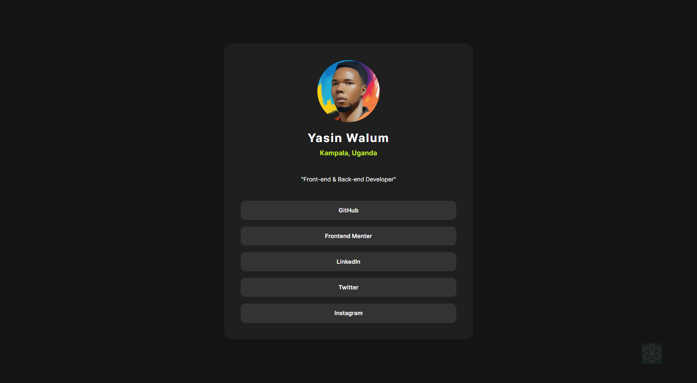

# Frontend Mentor - Social links profile solution

This is a solution to the [Social links profile challenge on Frontend Mentor](https://www.frontendmentor.io/challenges/social-links-profile-UG32l9m6dQ). Frontend Mentor challenges help you improve your coding skills by building realistic projects.

## Table of contents

- [Frontend Mentor - Social links profile solution](#frontend-mentor---social-links-profile-solution)
  - [Table of contents](#table-of-contents)
  - [Overview](#overview)
    - [The challenge](#the-challenge)
    - [Screenshot](#screenshot)
    - [Links](#links)
  - [My process](#my-process)
    - [Built with](#built-with)
    - [What I learned](#what-i-learned)
  - [Author](#author)

## Overview

### The challenge

Users should be able to:

-   See hover and focus states for all interactive elements on the page

### Screenshot

### Links

-   Solution URL: [Add solution URL here](https://www.frontendmentor.io/challenges/social-links-profile-UG32l9m6dQ/hub?share=true)
-   Live Site URL: [Add live site URL here](https://celebrated-torrone-a0f78a.netlify.app/)

## My process

### Built with

-   Semantic HTML5 markup
-   CSS custom properties
-   Flexbox
-   CSS Grid
-   Mobile-first workflow

### What I learned

Proper use of hsl color format

## Author

-   Website - [Yasin Walum](https://www.ywalum.com)
-   Frontend Mentor - [@yourusername](https://www.frontendmentor.io/profile/wyasyn)
-   Twitter - [@wyasyn](https://www.twitter.com/wyasyn)
